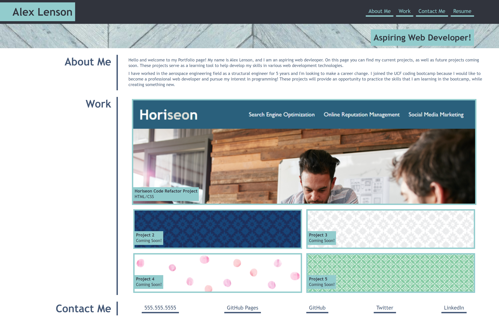

# Module 2 Challenge

## Portfolio

The purpose of this project is to create a portofolio of my projects that I complete in the UCF coding bootcamp. These projects serve as opportunites to practice and document the skills learned during the bootcamp. The following was accomplished: 
- Gain familiarity with various web development technologies by completing real world projects
- Document projcts to present to future employers
- Create something new, further cementing newfound skills 
  

## My Portfolio Page

## Deployment
See it live at: https://alexlenson.github.io/Module-2-Challenge-Portfolio/
